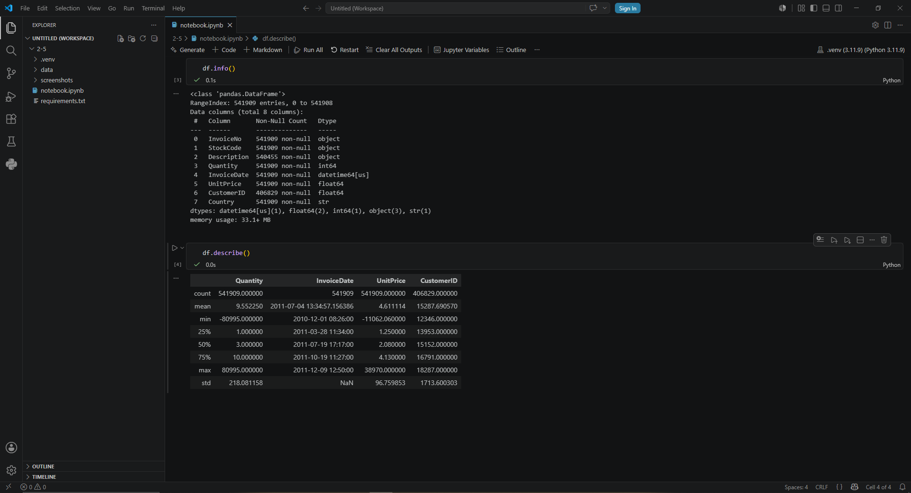
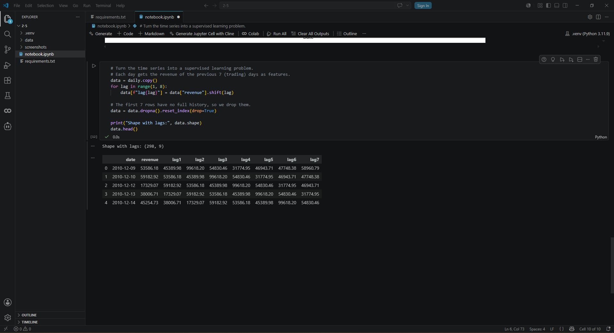
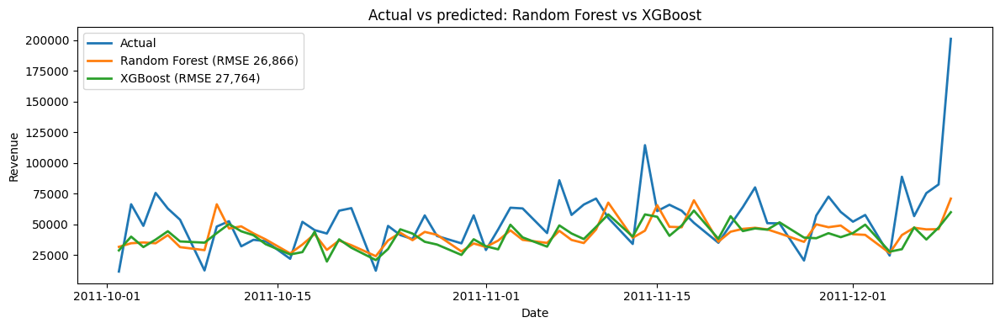
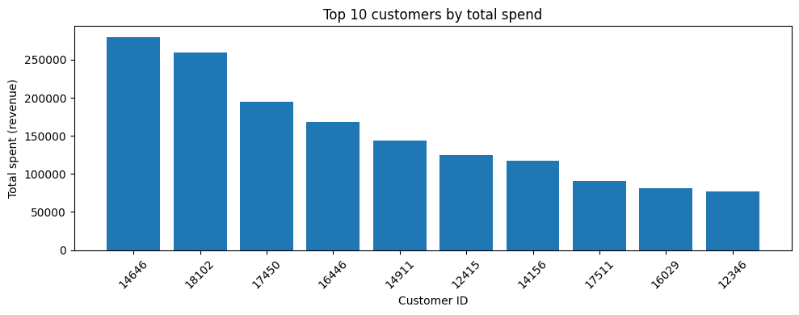
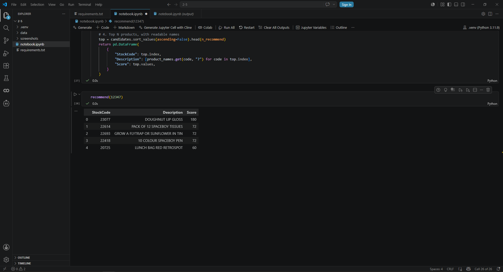

# Retail Sales Forecasting and Recommender

## Overview

This project analyses one year of transactional data from a UK online retailer and
turns it into two practical tools: a **next-day sales forecast** and a **product
recommendation system**.

The forecasting part compares three models — Random Forest, XGBoost, and an LSTM
neural network — on the same time series, using a chronological train/test split so
the evaluation reflects how the models would actually be used: predicting the future
from the past. The recommendation part analyses individual customers and suggests
products through user-based collaborative filtering.

One theme runs through the project: **data is cleaned for its purpose, not "in
general."** The forecast and the recommender need different things from the same raw
data, so they are cleaned differently — and that decision is made explicitly.

## Technologies Used

- **Python** — core language
- **pandas / NumPy** — data loading, cleaning, and aggregation
- **scikit-learn** — Random Forest, train/test split, feature scaling, RMSE, and cosine similarity
- **XGBoost** — gradient-boosting forecasting model
- **TensorFlow / Keras** — LSTM neural network
- **matplotlib** — visualizations
- **Jupyter Notebook** — analysis environment
- **VS Code** — development environment

## Setup

### Requirements
- Python 3.11
- The UCI Online Retail dataset (see *Dataset* below)

### Install dependencies
```powershell
py -3.11 -m venv .venv
.venv\Scripts\activate
pip install -r requirements.txt
```

### Add the dataset
The dataset is not committed to the repository (it is large and externally licensed).
Download `Online Retail.xlsx` from the
[UCI repository](https://archive.ics.uci.edu/dataset/352/online+retail), create a
`data/` folder in the project root, and save the file as:
```
data/online_retail.xlsx
```

### Run
Open `notebook.ipynb` in VS Code (or Jupyter), select the `.venv` kernel, and run all cells.

## The Data

The raw data has three quality issues that shape every later decision: about a quarter
of the rows have no customer ID, some quantities are negative (cancellations and
returns), and some unit prices are negative (accounting adjustments).



`info()` reveals the missing customer IDs; `describe()` reveals the negative quantities
and prices. These are facts about the data rather than errors — and how they are
handled depends on what the data is used for.

## Part 1 — Sales Forecasting

### Cleaning for the forecast
The forecast needs only a date and an amount, so rows without a customer ID are kept,
while cancellations (negative quantity) and invalid prices are removed. A `Revenue`
column (`Quantity × UnitPrice`) is computed in code rather than taken from the source.

### From a time series to a learning problem
Daily revenue is aggregated into a time series, then turned into a supervised problem
with seven **lag features** — each day is described by the revenue of the previous
seven trading days.



### Avoiding data leakage
The train/test split is **chronological, not shuffled**. Shuffling would let the models
train on future days and be tested on past ones — a leak that produces impressive but
meaningless results. With `shuffle=False`, the models train on the earlier ~80% of days
and are tested on the later ~20%, which is the harder pre-Christmas period.

### Three models, one comparison
Random Forest and XGBoost are trained on the lag features directly. The LSTM
additionally requires the data to be scaled (fit on the training set only, to avoid
leakage) and reshaped into sequences — a step that neural networks need to train stably.



Both tree models track the calm periods well but stay flat at the peaks: a tree-based
model cannot predict a value higher than any it saw in training, so it systematically
under-predicts the pre-Christmas spikes.


| Model | RMSE |
|---|---|
| Random Forest | 26,866 |
| XGBoost | 27,764 |
| LSTM | 30,086 |
| Naive baseline (persistence) | 30,373 |

**Random Forest performed best, and the LSTM was the weakest.** With only ~238 training
days, the neural network had too little data to compete with the tree ensembles. On a
small tabular dataset the simpler model was the stronger choice — a reminder that added
complexity does not guarantee a better result.
A naive persistence baseline (predict each day as the previous one) anchors these
numbers: Random Forest and XGBoost beat it by ~12% and ~9%, so they add real value,
while the LSTM barely edges past it — further evidence that deep learning does not pay
off on a dataset this small.

## Part 2 — Customer Analysis and Recommendations

### Cleaning for the customer
Here the customer is essential, so rows without a customer ID are dropped, returns are
removed, and customer IDs are converted to integers.

### Who are the valuable customers?
Per-customer metrics (order count, total items, total spend) show that "valuable
customer" is not a single profile: some buy frequently in small amounts, others place
rare but very large wholesale orders.



### A collaborative-filtering recommender
Each customer is represented as a row in a user–item matrix (products bought, by
quantity). Cosine similarity measures how alike customers are by their purchase pattern
rather than their volume. For a target customer, the system finds the most similar
customers and recommends products they bought that the target has not, weighting each
similar customer's purchases by how similar they are so closer matches count more —
mapped back to readable product names. New customers with no history fall back to the
most popular products, so the recommender always returns something.

The recommender is evaluated the same way the forecast is — against a trivial baseline.
Using a leave-one-out hit-rate@5 (hide one product a customer actually bought, then check
whether it appears in their top-5 recommendations), collaborative filtering reached 4.3%,
about six times the 0.7% of simply recommending the most popular products. The
personalised approach measurably beats the trivial one.



## Key Design Decisions

### 1. Data is cleaned for its purpose
The forecast keeps anonymous rows (it only needs date and money); the recommender drops
them (it is about customers). The same raw data is cleaned two different ways, on purpose.

### 2. No shuffling in the train/test split
For a time series, shuffling leaks future information into training. A chronological
split keeps the evaluation honest.

### 3. The LSTM is scaled; the trees are not
Neural networks train poorly on large raw values, so the inputs are scaled to ~0–1 (fit
on training data only). Tree models split on thresholds and are indifferent to scale, so
they are left unscaled.

### 4. Reproducible by design
Dependencies are pinned in `requirements.txt`, random seeds are fixed, and the dataset is
documented rather than committed, so the environment and results can be reproduced exactly.

## Scope and Limitations

- **One year of data.** The series covers ~1 year, so no multi-year seasonality can be learned.
- **Trading-day lags.** Lag features use trading-day order, not strict calendar days, because the retailer did not trade every day.
- **Tree models cannot extrapolate.** Random Forest and XGBoost cannot predict above their training maximum, so they under-predict revenue spikes.
- **Cold-start fallback is not personalised.** New customers with no history receive the globally most popular products rather than personalised recommendations.

## Possible Improvements

- Use a forecasting method that models seasonality (e.g. SARIMA or Prophet).
- Give cold-start customers a smarter fallback (e.g. trending or category-based picks) instead of global popularity.
- Tune model hyperparameters and add calendar features (day of week, month, holidays).

## Dataset

[Online Retail](https://archive.ics.uci.edu/dataset/352/online+retail) — UCI Machine
Learning Repository. ~541,909 transactions from a UK-based online gift retailer between
December 2010 and December 2011. Licensed under CC BY 4.0.
> Chen, D. (2015). Online Retail [Dataset]. UCI Machine Learning Repository.
> https://doi.org/10.24432/C5BW33
